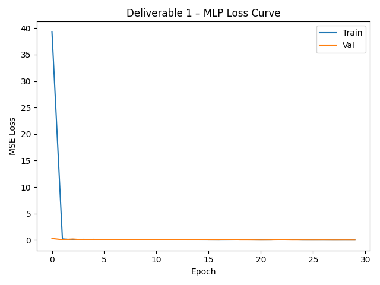
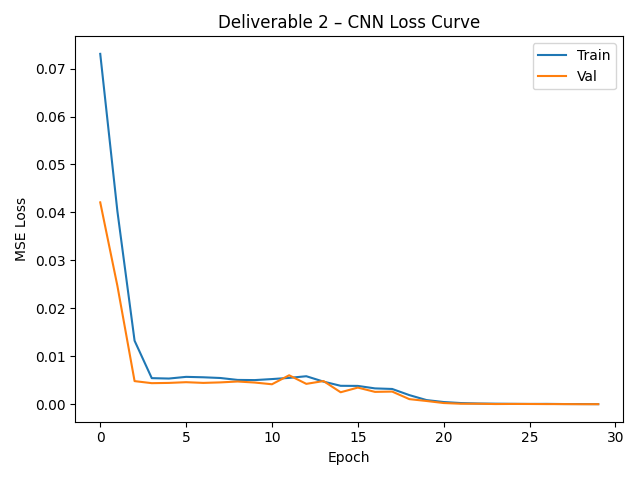
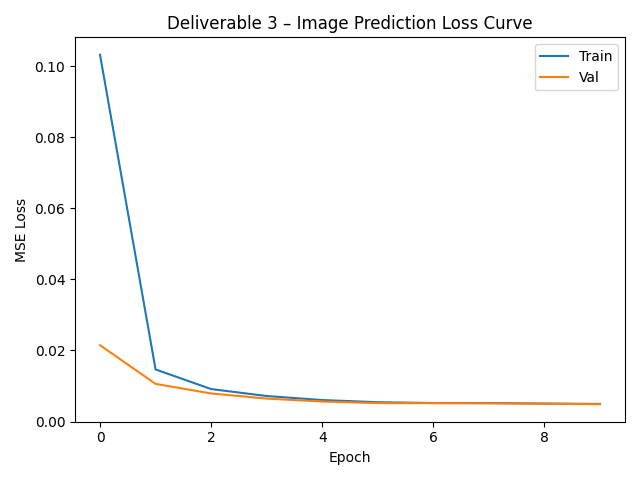
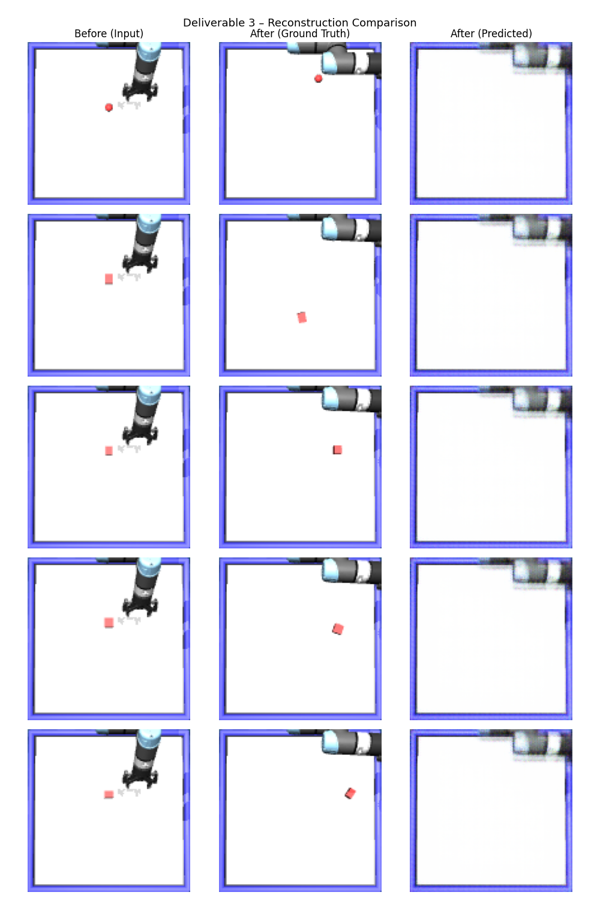

# CMPE 591 – Homework 1: Training a DNN using PyTorch

## Model Weights
Due to file size limits, trained model weights are hosted on Google Drive:
👉 [Download model weights (.pth files)](https://drive.google.com/drive/folders/1BYtEt5Ym_4LSu6G5aEn77iCzlCUYUFL4?usp=sharing)

deliverable1.pth — MLP position predictor
deliverable2.pth — CNN position predictor
deliverable3.pth — CNN image predictor

## Setup

### Option A – Conda / Mamba (recommended)
```bash
conda env create -f environment.yml
conda activate envforcmpe591
# or with mamba:
mamba env create -f environment.yml
mamba activate envforcmpe591
```

### Option B – pip
```bash
pip install -r requirements.txt
```

> **macOS note:** If you see an OpenMP error, run:
> ```bash
> export KMP_DUPLICATE_LIB_OK=TRUE
> ```

---

## Data Collection

Run the teacher's data collection script (4 parallel processes × 250 samples = 1000 total):

```bash
python homework1.py
```

This generates `positions_{0..3}.pt`, `actions_{0..3}.pt`, and `imgs_{0..3}.pt`.

For **Deliverable 3**, also run the provided collection script to generate before-images:

```bash
python collect_data.py
```

This generates `imgs_before_{0..3}.pt`.

---

## Running the Deliverables

```bash
# Deliverable 1 – MLP position prediction
python deliverable1.py --mode both --epochs 30

# Deliverable 2 – CNN position prediction
python deliverable2.py --mode both --epochs 30

# Deliverable 3 – CNN image prediction (run collect_data.py first)
PYTORCH_ENABLE_MPS_FALLBACK=1 python deliverable3.py --mode both --epochs 10
```

---

## Deliverable 1 – MLP for Position Prediction

Plain Multi-Layer Perceptron that predicts (x, y) object position after an action.

**Input:** raw image (3×128×128, flattened) + one-hot action (4,)  
**Output:** (x, y) position after the action  
**Architecture:** Linear(49156→1024) → ReLU → Linear(1024→512) → ReLU → Linear(512→256) → ReLU → Linear(256→2)

### Loss Curve


### Test Error
| Metric | Value |
|--------|-------|
| Test MSE | 0.004513 |

---

## Deliverable 2 – CNN for Position Prediction

Convolutional Neural Network that encodes the image and predicts (x, y) object position.

**Input:** raw image (3×128×128) + one-hot action (4,)  
**Output:** (x, y) position after the action  
**Architecture:** 4× Conv2d encoder → AdaptiveAvgPool → Linear head

### Loss Curve


### Test Error
| Metric | Value |
|--------|-------|
| Test MSE | 0.000043 |

> The CNN achieves ~100× lower error than the MLP, showing that convolutional features are much more effective for spatial reasoning from images.

---

## Deliverable 3 – CNN for Image Prediction

Instead of predicting a position, the model predicts the **raw image** of the environment after the action. Output is guaranteed to be 3×128×128 — the same dimensions as the input.

**Input:** before-image (3×128×128) + one-hot action (4,)  
**Output:** predicted after-image (3×128×128)  
**Architecture:** Encoder (Conv2d ×4) → action injection (Linear) → Decoder (ConvTranspose2d ×4) → Sigmoid

### Loss Curve


### Test Error
| Metric | Value |
|--------|-------|
| Test MSE | 0.004897 |

### Reconstructed vs Ground Truth Images
Each row shows: the input before-image, the real after-image (ground truth), and the model's predicted after-image.



---

## Results Summary

| Deliverable | Model | Task | Test MSE |
|-------------|-------|------|----------|
| D1 | MLP | Position prediction | 0.004513 |
| D2 | CNN | Position prediction | 0.000043 |
| D3 | CNN Encoder-Decoder | Image prediction | 0.004897 |

---

## File Structure

```
.
├── homework1.py          # Teacher's environment + data collection
├── collect_data.py       # Collects before/after image pairs for D3
├── deliverable1.py       # D1: MLP position predictor
├── deliverable2.py       # D2: CNN position predictor
├── deliverable3.py       # D3: CNN image predictor
├── environment.yml       # Conda environment spec
├── requirements.txt      # pip requirements
├── deliverable1.pth      # Trained D1 model weights
├── deliverable2.pth      # Trained D2 model weights
├── deliverable3.pth      # Trained D3 model weights
├── d1_loss_curve.png
├── d2_loss_curve.png
├── d3_loss_curve.png
└── d3_reconstructions.png
```
