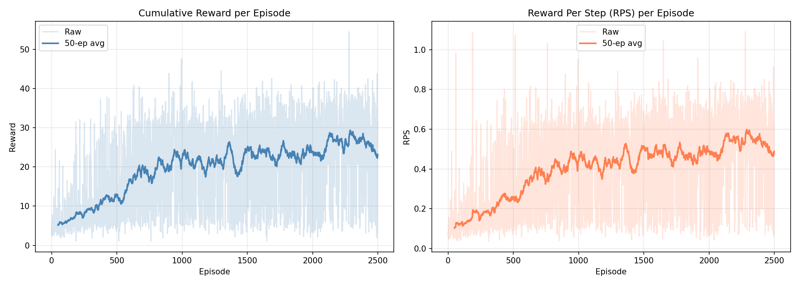
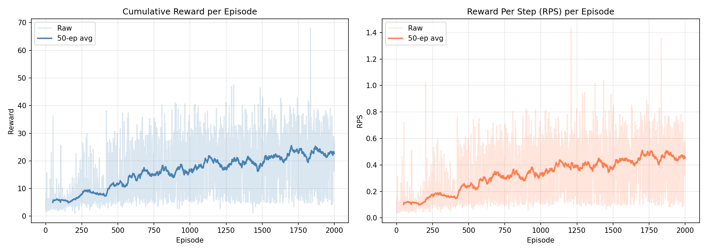
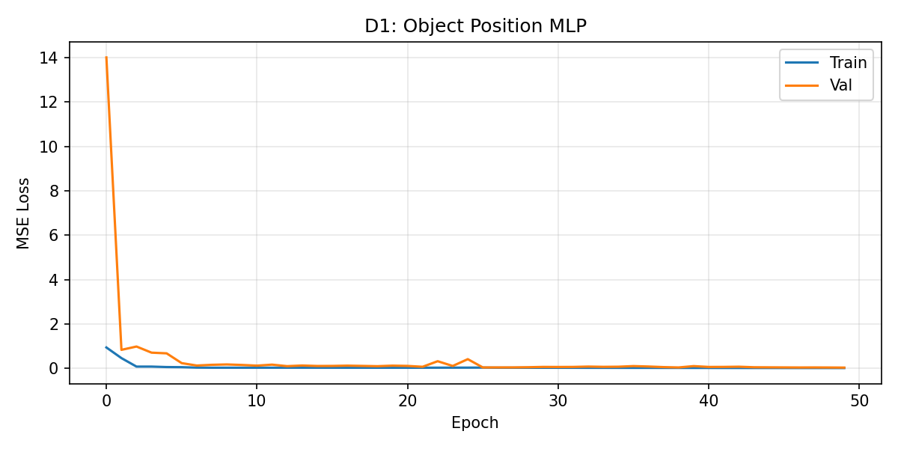
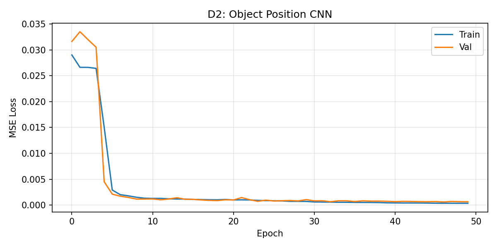
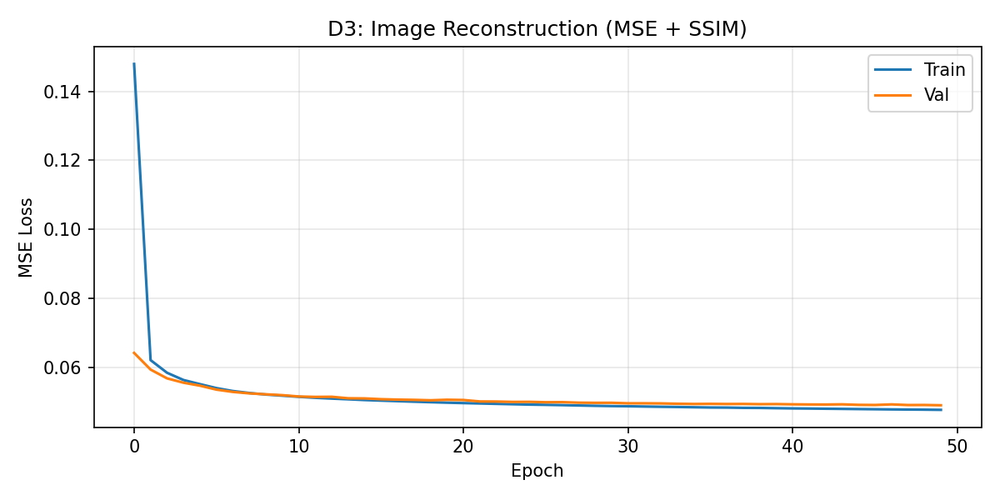
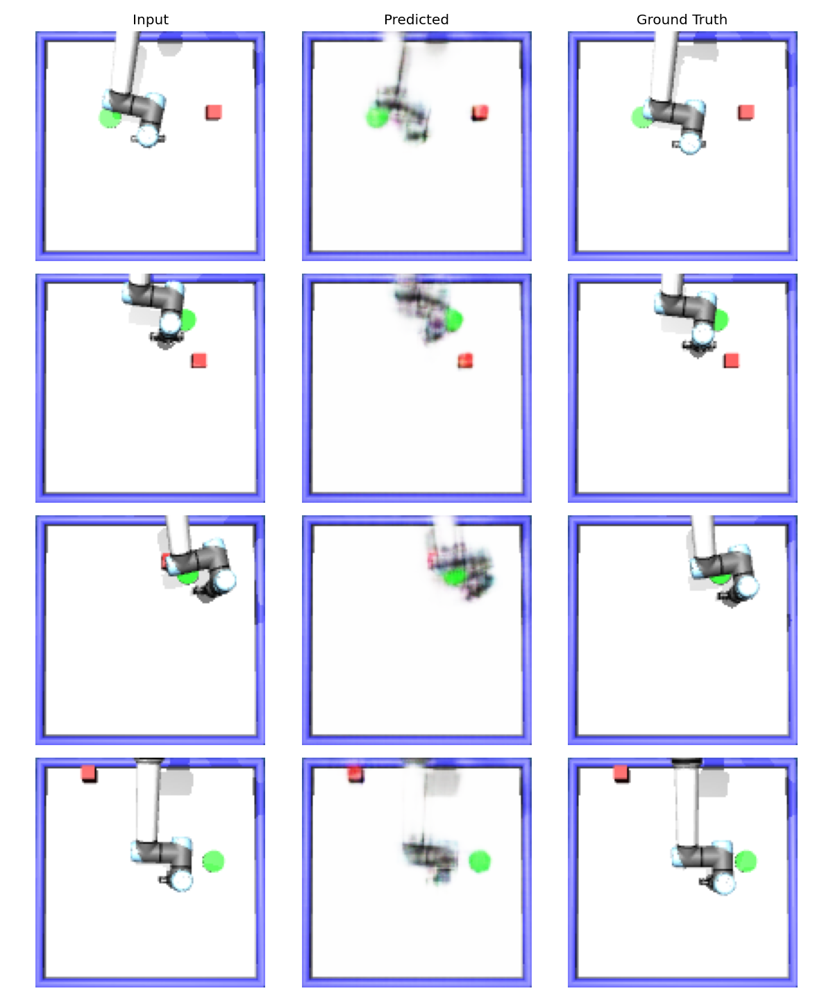

# Homework 2 — Deep Q-Network (DQN)

**Course:** CMPE 591  
**Environment:** MuJoCo tabletop pushing task  
**Goal:** Train a robot arm to push an object to a target position using reinforcement learning, then build forward models that predict object positions and future images.

---

## Setup

```bash
conda activate envforcmpe591
export KMP_DUPLICATE_LIB_OK=TRUE   # Mac only

# Run 1 — instructor baseline
python dqn_solution_instructor.py

# Run 2 — our improved settings
python dqn_solution.py
```

---

## Environment

The robot end-effector moves in **8 discrete directions**. Each episode places the object and goal at random positions. Reward:

```
reward = 1 / distance(ee, obj) + 1 / distance(obj, goal)
```

Episodes end after **50 steps** or when the object reaches the goal.

---

## Hyperparameter Runs

Three configurations were tested. The key differences are summarised below:

| Parameter | Run 1 — Baseline (Instructor) | Run 2 — Improved (Ours) |
|---|---|---|
| `n_episodes` | 2500 | 2000 |
| `buffer_length` | 10,000 | 50,000 |
| `batch_size` | 128 | 64 |
| `eps_start` | 0.9 | 1.0 |
| `eps_decay` | 10,000 steps linear | 0.997 multiplicative |
| `eps_end` | 0.05 | 0.05 |
| `gamma` | 0.99 | 0.99 |
| `lr` | 1e-4 | 3e-4 |
| `tau` (soft update) | 0.005 | 0.005 |
| LR scheduler | None | StepLR (×0.5 / 500ep) |
| Loss | Huber | Huber |

---

## Run 1 — Baseline (Instructor Parameters)

**What changed:** Used the exact hyperparameters provided by the instructor. Linear epsilon decay over 10,000 steps, small buffer (10k), fixed learning rate.

**Results:**

| Metric | Ep 50 | Ep 500 | Ep 1000 | Ep 2500 |
|---|---|---|---|---|
| Avg Reward | ~5.2 | ~13.0 | ~22.1 | ~23.2 |
| Avg RPS | ~0.10 | ~0.26 | ~0.44 | ~0.49 |

**Eval (mean):** Reward = 25.86 | RPS = 0.541

**Discussion:**  
Linear epsilon decay causes the agent to stop exploring very quickly — epsilon reaches 0.05 already around episode 200. Despite this, the soft target update (tau=0.005) provides stable learning. However, the small buffer (10k) limits experience diversity, and without a learning rate scheduler the agent plateaus after episode 1000 with no further improvement. Performance stabilises around reward ~23-25.

---

## Run 2 — Improved

**What changed from Run 1:**
- Buffer increased from 10k → 50k (more diverse experience)
- Learning rate increased from 1e-4 → 3e-4 (faster early learning)
- Epsilon decay changed to multiplicative 0.997 (slower, more exploration)
- eps_start changed to 1.0 (full exploration at the beginning)
- Added StepLR scheduler (lr ×0.5 every 500 episodes)

**Results:**

| Metric | Ep 50 | Ep 500 | Ep 1000 | Ep 2000 |
|---|---|---|---|---|
| Avg Reward | ~5.0 | ~11.7 | ~16.4 | ~22.7 |
| Avg RPS | ~0.10 | ~0.24 | ~0.33 | ~0.45 |

**Eval (mean):** Reward = 25.83 | RPS = 0.517

**Discussion:**  
Starting with eps=1.0 and slower multiplicative decay means the agent explores more thoroughly in early episodes. This builds a richer replay buffer, which combined with the larger 50k buffer leads to more stable and consistent learning. The LR scheduler prevents overfitting to early experiences — clear performance jumps are visible at each LR decay step (episodes 500, 1000, 1500). Final performance is similar to Run 1 but the learning curve is smoother and more monotonically increasing.

---

---

## Training Curves

**Run 1 — Baseline (Instructor Parameters)**  


**Run 2 — Improved (Our Settings)**  


---

## Network Architecture

### DQN — MLP (high-level state)

```
Input: [ee_x, ee_y, obj_x, obj_y, goal_x, goal_y]  →  6-dim

Linear(6, 256) → LayerNorm → ReLU
Linear(256, 256) → LayerNorm → ReLU
Linear(256, 128) → ReLU
Linear(128, 8)   →  Q-value for each action
```

**Double DQN:** Online network selects action, target network evaluates it — prevents Q-value overestimation.  
**Soft target update:** `target = tau * online + (1-tau) * target` — smoother than hard updates.  
**Huber loss:** More robust than MSE for large TD errors.

---

## Deliverables

### Deliverable 1 — Object Position Prediction (MLP)

Predicts next object `(x, y)` from flattened image + one-hot action.

```
Flatten: 3×128×128 = 49,152  +  action (8)  =  49,160 input

Linear(49160→512) → ReLU → Linear(512→256) → ReLU
→ Linear(256→128) → ReLU → Linear(128→2)
```

| Epoch | Train Loss | Val Loss |
|---|---|---|
| 10 | 0.025 | 0.970 |
| 30 | 0.021 | 0.985 |
| 50 | 0.019 | 0.953 |

High val loss (~1.0) shows that flattening loses spatial structure — the MLP memorises training positions but fails to generalise. This is expected and motivates the CNN approach.



### Deliverable 2 — Object Position Prediction (CNN)

Same task using a CNN backbone to preserve spatial structure.

```
Conv(3→32) → Conv(32→64) → Conv(64→128) → Conv(128→256) → Conv(256→512)
→ AvgPool → 512-dim  +  action (8)  →  Linear(520→256→2)
```

| Epoch | Train Loss | Val Loss |
|---|---|---|
| 10 | 0.00102 | 0.00171 |
| 30 | 0.00065 | 0.00094 |
| 50 | 0.00050 | 0.00085 |

**~1100× lower val loss than MLP** (0.00085 vs 0.953). CNN spatial features dramatically outperform flat pixel vectors.



### Deliverable 3 — Post-Action Image Reconstruction

Reconstructs the next frame given current image + action, using a UNet encoder-decoder with skip connections.

**Loss:** `0.5 × MSE + 0.5 × SSIM` — SSIM preserves edges and small objects (red cube, green circle).

| Epoch | Train Loss | Val Loss |
|---|---|---|
| 10 | 0.0523 | 0.0524 |
| 30 | 0.0491 | 0.0498 |
| 50 | 0.0481 | 0.0494 |

Train and val loss track each other closely — no overfitting. Skip connections allow fine spatial details to pass directly to the decoder.





---

## Files in This Repository

| File | Description |
|---|---|
| `dqn_solution.py` | Run 2 — our improved settings |
| `dqn_solution_instructor.py` | Run 1 — instructor baseline settings |
| `homework2.py` | Environment definition (provided by instructor) |
| `environment.py` | Base environment (provided by instructor) |
| `README.md` | This file |
| `training_curves_instructor.png` | Run 1 — instructor baseline reward and RPS curves |
| `training_curves.png` | Run 2 — our settings reward and RPS curves |
| `d1_loss_instructor.png` | Run 1 — D1 MLP loss curve |
| `d2_loss_instructor.png` | Run 1 — D2 CNN loss curve |
| `d3_loss_instructor.png` | Run 1 — D3 reconstruction loss curve |
| `d3_reconstructions_instructor.png` | Run 1 — sample reconstructions |
| `d1_loss.png` | D1 MLP train/val loss |
| `d2_loss.png` | D2 CNN train/val loss |
| `d3_loss.png` | D3 reconstruction train/val loss |
| `d3_reconstructions.png` | Sample input / predicted / ground truth images |
| `dqn_checkpoint.pt` | Trained DQN weights — **[Google Drive](https://drive.google.com/drive/folders/1oRG1V8URITNCBWcqE6fBedMgUicpcTrp?usp=sharing)** |
| `obj_pos_mlp.pt` | D1 MLP weights — **[Google Drive](https://drive.google.com/drive/folders/1oRG1V8URITNCBWcqE6fBedMgUicpcTrp?usp=sharing)** |
| `obj_pos_cnn.pt` | D2 CNN weights — **[Google Drive](https://drive.google.com/drive/folders/1oRG1V8URITNCBWcqE6fBedMgUicpcTrp?usp=sharing)** |
| `img_recon.pt` | D3 reconstruction weights — **[Google Drive](https://drive.google.com/drive/folders/1oRG1V8URITNCBWcqE6fBedMgUicpcTrp?usp=sharing)** |

> **Model Weights (Google Drive):** [Download all `.pt` files](https://drive.google.com/drive/folders/1oRG1V8URITNCBWcqE6fBedMgUicpcTrp?usp=sharing)  
> Place them into the `src/` folder before running evaluation.

---

## How to Reproduce

```bash
git clone https://github.com/yagmurUlusan/cmpe591
cd cmpe591/hw2
conda activate envforcmpe591
export KMP_DUPLICATE_LIB_OK=TRUE

# Run 1 (instructor baseline)
python dqn_solution_instructor.py

# Run 2 (our improved settings)
python dqn_solution.py

# Runtime: ~2-3 hours per run on Apple M-series (MPS)
```
